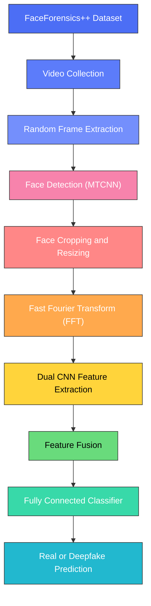
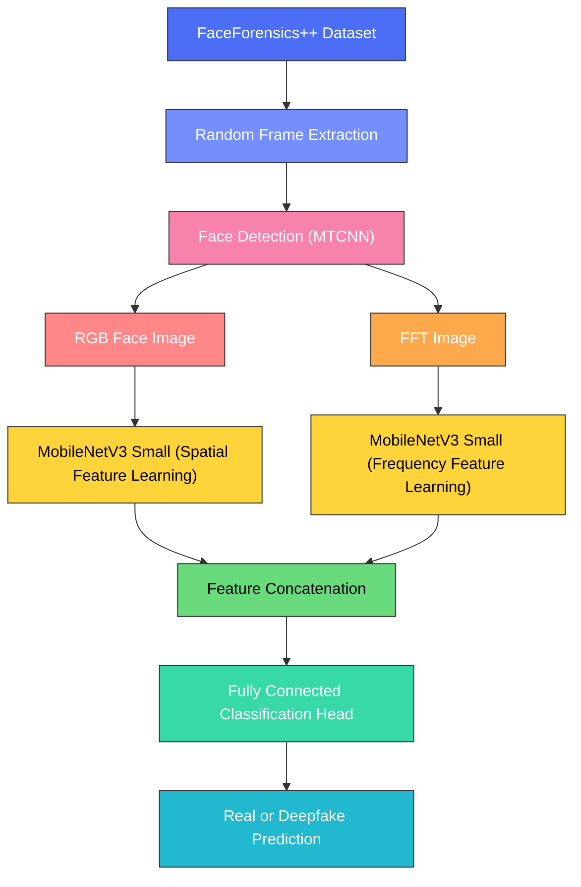
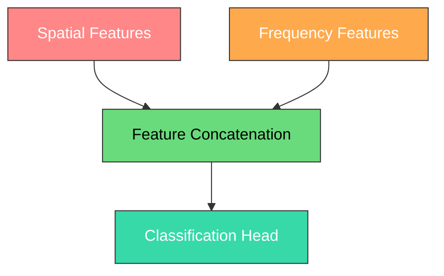

# 🛡️ Deepfake Detection using Dual-Stream CNN

### Spatial + Frequency Domain Learning for Robust Deepfake Detection

---

## 📌 Overview

Deepfake videos generated using modern Artificial Intelligence techniques have become increasingly realistic, making them difficult to distinguish from authentic media. This project presents a **Dual-Stream Deepfake Detection Framework** that simultaneously learns from both **Spatial (RGB)** and **Frequency Domain (FFT)** representations. By combining these complementary features, the model accurately classifies facial images as **Real** or **Deepfake**.

The complete pipeline includes video preprocessing, face extraction, frequency transformation, dual-stream feature learning, feature fusion, model training, and confidence-based inference.

---

## ✨ Key Features

- 🎬 End-to-End Deepfake Detection Pipeline
- 🙂 Automatic Face Detection using MTCNN
- 📊 Frequency Domain Analysis using Fast Fourier Transform (FFT)
- 🧠 Dual MobileNetV3 Small Feature Extractors
- 🔗 Spatial and Frequency Feature Fusion
- ⚡ Lightweight & Efficient CNN Architecture
- 🚀 GPU Accelerated Training
- 💾 Automatic Best Model Checkpoint Saving
- 🎯 High Validation Accuracy (~95%)
- ✅ Confidence-Based Prediction

---

## 🔄 Project Workflow



---

## 🏗️ System Architecture



---

## 📂 Dataset — FaceForensics++

**Dataset Components**
- Original Videos (Real)
- Deepfake Videos (Manipulated)

**Dataset Preparation**
- Random Frame Extraction
- Face Detection using MTCNN
- Face Cropping & Resizing (224 × 224)
- FFT Image Generation
- Balanced Training & Validation Dataset

---

## 🧠 Model Architecture

### 🎨 Spatial Stream

| | |
|---|---|
| **Input** | RGB Face Image |
| **Backbone** | MobileNetV3 Small |
| **Learns** | Facial Texture, Eye Features, Mouth Features, Blending Artifacts, Visual Inconsistencies |

### 📡 Frequency Stream

| | |
|---|---|
| **Input** | FFT Image |
| **Backbone** | MobileNetV3 Small |
| **Learns** | Frequency Artifacts, Compression Noise, Hidden Manipulation Patterns, Spectral Irregularities |

### 🔗 Feature Fusion



---

## ⚙️ Training Configuration

| Parameter | Value |
|-----------|-------|
| Framework | PyTorch |
| Backbone | MobileNetV3 Small |
| Dataset | FaceForensics++ |
| Face Detection | MTCNN |
| Frequency Analysis | FFT |
| Optimizer | Adam |
| Loss Function | BCEWithLogitsLoss |
| Batch Size | 4 |
| Image Size | 224 × 224 |
| Hardware | NVIDIA DGX GPU |

---

## 📊 Results

| Metric | Performance |
|--------|-------------|
| Validation Accuracy | **95%** |
| Model | DualCNN |
| Task | Binary Classification |
| Classes | Real / Deepfake |

---

## 🔍 Sample Prediction

```text
Inference Result

Sample Image : 023_4.jpg
Prediction   : Deepfake
Confidence   : 85.27%
```

---

## 📁 Project Structure

```text
Deepfake-Detection/
│
├── raw_data/
├── frames/
├── faces/
├── fft/
├── notebooks/
├── models/
│   └── best_model.pth
├── download.py
├── requirements.txt
├── README.md
└── LICENSE
```

---

## 🛠️ Technologies Used

Python · PyTorch · TorchVision · OpenCV · NumPy · MTCNN · Fast Fourier Transform (FFT) · MobileNetV3 Small · CUDA · FaceForensics++

---

## 🚀 Future Scope

- 🔄 Adaptive Feature Fusion
- 🔬 Explainable Deepfake Detection
- 🎛️ Multi-Frequency Learning
- 🧩 Vision Transformer Integration
- ⚛️ Quantum Feature Representation
- 🌍 Cross-Dataset Generalization
- ⏱️ Real-Time Deepfake Detection
- 📱 Edge AI Deployment

---

## 📝 Conclusion

This project presents a lightweight yet powerful Deepfake Detection Framework that combines **Spatial (RGB)** and **Frequency Domain (FFT)** learning for reliable detection of manipulated facial content.

By integrating complementary feature representations through a Dual-Stream MobileNetV3 architecture, the proposed framework achieves approximately **95% validation accuracy**, demonstrating the effectiveness of combining visual and frequency-domain information for robust deepfake detection.

---

## ⭐ Support

If you found this project useful, consider giving it a **Star ⭐** and sharing it with the community.
